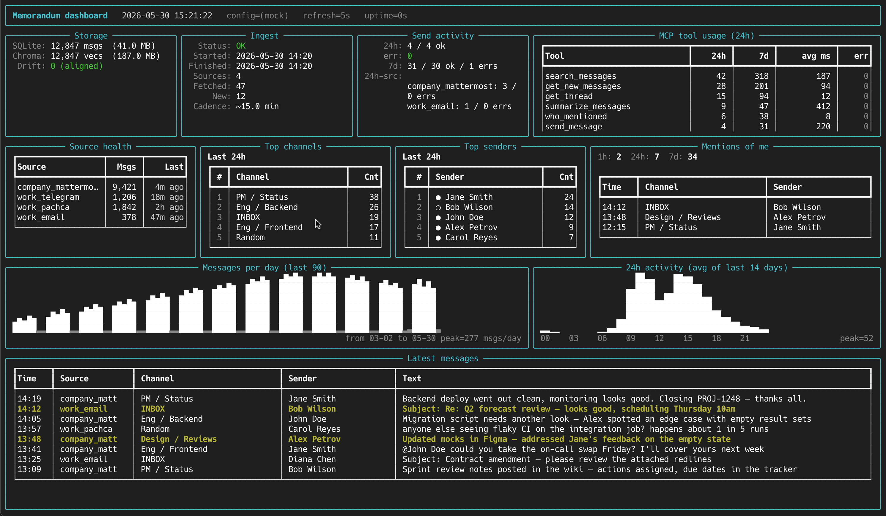

# Memorandum Message Collector

[](https://github.com/shiryavsky/memorandum/actions/workflows/python-app.yml)
[](LICENSE)
[](https://www.python.org/downloads/)

**Язык:** [English](README.md) · [Deutsch](README.de.md) · Русский · [简体中文](README.zh-CN.md)

Хватит лазить по пяти чат-клиентам, чтобы вспомнить, что кто-то сказал в прошлый вторник. Memorandum собирает **Mattermost, Telegram, Pachca и почту по IMAP** в локальную поисковую базу и отдаёт её как MCP-инструменты — так что **Claude, Gemini, Hermes** и другие MCP-клиенты могут отвечать на вопросы по всем вашим рабочим перепискам сразу.

## Спросите у Claude, например

> *«Подведи итог обсуждения `PL-15491` в platform-команде за эту неделю.»*
>
> *«Меня кто-нибудь @-упоминал по миграции вчера?»*
>
> *«Найди таблицу, которую Марина прислала во вторник, и вытащи цифры за Q3.»*
>
> *«Подготовь черновик ответа на последнее письмо клиента про дату запуска.»*

Memorandum работает локально — ваши сообщения и вложения не покидают машину, а агент общается с ними через MCP.

## Возможности

**Источники и синхронизация**
- Собирает сообщения из **Mattermost, Telegram, Pachca и IMAP** — можно несколько аккаунтов
- Инкрементальная синхронизация по каждому источнику; параллельный fetch (падение одного источника не валит остальные)
- Сохраняет **вложения при ingest'е** — критично для Pachca и Telegram, у которых URL быстро протухают
- YAML-фильтры на каждый источник: пропуск ботов, каналов и regex-паттернов

**Поиск и выборка**
- **Двухслойное хранилище** — SQLite для структурных запросов (отправитель / канал / диапазон времени), ChromaDB для семантического поиска
- **Live-чтение свежего хвоста** — `get_new_messages` обращается напрямую к источнику, так что агент увидит новые сообщения перед ответом и правильно отреагирует
- **Восстановление тредов** — `get_thread` возвращает корневое сообщение и все ответы, в том числе через папки IMAP
- **Ссылки на задачи YouTrack** — id задач (например, `PL-15491`) парсятся из URL и имён каналов; `find_by_issue` возвращает всё, что на них ссылается
- **Permalink'и** на каждом результате — клик возвращает к оригинальному сообщению

**Люди и идентичность**
- **Кросс-источниковые алиасы** с опциональными role / team / reports-to / responsible-for — агент с первой сессии знает, кто есть кто
- **Алиасы, в которые агент может писать** — Claude может обновлять информацию о людях (смена роли, новый проект) прямо в `config.yaml` (round-trip сохраняет ваши комментарии)
- **Свои vs внешние** — слоистая классификация (флаг источника → email-домен → переопределение в алиасе); внешние отправители получают метку `[external]`
- **Граф упоминаний** — `who_mentioned` отвечает на «кто пинговал меня / Алису на этой неделе» с разрешением алиасов

**Эксплуатация**
- **MCP-сервер** с инструментами для поиска, summarize, дайджеста, решений, тредов, поиска по issue и доступа к файлам
- **Отправка ответов** (opt-in, по галке на источник) — поддерживаются Telegram business-чаты; ответы на письма уходят в папку Drafts на ревью
- **Retention / housekeeping** — автоматическое удаление старых сообщений и векторов; content-addressed sweep вложений оставляет всё, на что ещё кто-то ссылается
- **CLI**: `./bin/memorandum {health, dashboard, aliases refresh, prune, reindex-chroma}` — терминальный TUI и housekeeping-инструменты

Детали реализации (архитектура, схемы, внутренности синка) — в [AGENTS.md](AGENTS.md).

## Быстрый старт

### 1. Клонировать репозиторий

```bash
git clone https://github.com/shiryavsky/memorandum.git
cd memorandum
```

### 2. Установка (macOS/Linux)

```bash
./setup.sh
```

`setup.sh` создаёт `.venv`, ставит Python-зависимости и при первом запуске разворачивает `config.yaml` из `config.example.yaml`. На Linux предварительно ставится CPU-only PyTorch (транзитивная зависимость FlagEmbedding) из [PyTorch CPU index](https://download.pytorch.org/whl/cpu) — так пропускается бандл CUDA на ~1.3 ГБ. На macOS torch уже под CPU.

По умолчанию устанавливается универсальная модель для нескольких языков — подходит под русский.

### 3. Конфигурация

Откройте `config.yaml` (создан в шаге 2 из `config.example.yaml`) и добавьте свои источники:

```yaml
sources:
  company_mattermost:
    type: mattermost
    enabled: true
    url: "https://mattermost.yourcompany.com"
    token: "your-personal-access-token"   # Account Settings → Security
    internal: true                        # отправители здесь — сотрудники компании (внешние получают метку [external])
    allow_send: false                     # по умолчанию; поставьте true, чтобы send_message мог постить сюда
    filters:
      skip_senders: ["github-bot"]
      skip_channels: ["off-topic"]
      skip_patterns:
        - "^Reminder:"
        - "joined the channel"

  work_telegram:
    type: telegram
    enabled: true
    token: "123456:AABBcc..."   # от @BotFather

  work_pachca:
    type: pachca
    enabled: true
    token: "your-personal-access-token"   # Automations → API в настройках Pachca
    filters:
      skip_channels: ["random"]

display_timezone: "America/New_York"   # таймстемпы в выводе MCP

# Опционально: классифицировать ссылки на задачи YouTrack и имена каналов вида "PL-15491".
# Если блок пропустить, распознавание id отключится (URL'ы всё равно тянутся как generic).
youtrack:
  base_url: "https://youtrack.yourcompany.com"
  project_prefixes: [PL, DEMO, MOBILE]

# Текущий пользователь (всегда считается внутренним). Голые ники, без "@" впереди.
my_aliases:
  - "you"
  - "you.lastname"

# Канонические личности других людей. role / team / reports_to / responsible_for
# опциональны и отдаются через MCP-инструмент `get_user_aliases`.
user_aliases:
  - canonical_name: "Jane Smith"
    internal: true
    role: "Backend lead"
    team: "Platform"
    responsible_for: ["dev-pl", "PL-*"]
    aliases: ["jane", "jsmith"]
```

Совет: через пару недель ingest'а запустите `./bin/memorandum aliases refresh` — он напечатает stub-записи для каждого отправителя, которого ещё нет в `user_aliases`, отсортированные по количеству сообщений и помеченные источником. Вставьте нужные и проставьте `role`/`team`/`internal` руками.

### 4. Первый ingest

```bash
./run_ingest.sh --hours 720  # тянем последние 30 дней
```

### 5. Health-check

После первого ingest'а проверьте, что всё подцепилось — источники подключились, сообщения сохранились, эмбеддинги построились:

```bash
./bin/memorandum health
```

Тот же отчёт доступен как MCP-инструмент `get_health` после регистрации сервера.

### 6. Запуск планировщика (раз в 15 минут)

**Linux + systemd (рекомендуется для продакшена):**
```bash
sudo cp systemd/memorandum-collect.service /etc/systemd/system/
sudo cp systemd/memorandum-collect.timer /etc/systemd/system/
sudo systemctl daemon-reload
sudo systemctl enable --now memorandum-collect.timer
```

**macOS или окружения без systemd:**
```bash
./bin/memorandum-sync
```
Или запустить fallback-планировщик:
```bash
source .venv/bin/activate
python -m pipeline.scheduler
```

### 7. Подключить MCP-сервер

#### в Claude:

Добавить в конфиг Claude MCP (`~/.config/claude/mcp_servers.json`):

```json
{
  "memorandum": {
    "command": "/path/to/memorandum/.venv/bin/python",
    "args": ["/path/to/memorandum/mcp_server/server.py"],
    "cwd": "/path/to/memorandum",
    "timeout": 120
  }
}
```

#### в Hermes:

Добавить в конфиг Hermes (`~/.hermes/config.yaml`):

```yaml
mcp_servers:
  memorandum:
    command: /path/to/memorandum/.venv/bin/python
    args:
      - /path/to/memorandum/mcp_server/server.py
      - --config
      - /path/to/memorandum/config.yaml
    timeout: 120
```

Аргумент `--config` гарантирует, что сервер найдёт `config.yaml`, даже если рабочая директория не сработает.

### 8. (Опционально) Live-дашборд

Когда ingest уже работает по расписанию, терминальный TUI даёт обзор в одном экране — хранилище, состояние ingest'а, упоминания, активность отправки и использование MCP-инструментов. Удобно в tmux-панели:

```bash
./bin/memorandum dashboard
```

Обновляется каждые 5 секунд; выйти — клавиша `q`.



## Структура проекта

```
memorandum/
├── config.yaml              # учётки и настройки (в gitignore)
├── config.example.yaml      # пример конфига
├── requirements.txt         # Python-зависимости
├── requirements-dev.txt     # dev-зависимости (pytest, pytest-cov, responses)
│
├── connectors/                  # коннекторы к источникам
│   ├── CONTRIBUTING.md          # ★ как добавить новый коннектор — читать до того, как лезть в эту папку
│   ├── _common.py               # общие константы (размер inline-превью, дефолтные текстовые расширения)
│   ├── factory.py               # build_connector — единая точка сборки для ingest'а и MCP
│   ├── mattermost_connector.py  # Mattermost REST API (синк по каналам)
│   ├── telegram_connector.py    # Telegram Bot API (группы, каналы, business-сообщения; DM с ботом пропускаются)
│   ├── pachca_connector.py      # Pachca REST API (синк по курсору чата)
│   └── email_connector.py       # IMAP (папка-как-канал; threading по Message-ID; отправка = черновик)
│
├── pipeline/                # движок ingest'а (бежит под systemd)
│   ├── ingest.py            # оркестратор fetch → filter → store, один коннектор на источник
│   ├── format.py            # канонический рендерер сообщений (общий для MCP-сервера и дашборда)
│   ├── health.py            # сборщик health-отчёта и форматтер (общий для CLI и MCP)
│   ├── alias_resolver.py    # разрешение канонических личностей из user_aliases
│   ├── filter_engine.py     # YAML-фильтрация на каждый источник
│   └── scheduler.py         # fallback-планировщик (для окружений без systemd)
│
├── cli/                     # пользовательские CLI-инструменты (`python -m cli ...` / `bin/memorandum`)
│   ├── __main__.py          # argparse-диспетчер
│   ├── health.py            # `memorandum health` — обёртка над pipeline.health
│   ├── aliases.py           # `memorandum aliases refresh` — append-only-генератор стабов
│   ├── alias_writer.py      # общая YAML-round-trip-прослойка (используется refresh + MCP-инструментами на запись)
│   ├── prune.py             # `memorandum prune` — dry-run-предпросмотр retention'а / --commit
│   ├── dashboard.py         # `memorandum dashboard` — live rich TUI (read-only DB)
│   └── reindex.py           # `memorandum reindex-chroma` — снос и пересборка chroma из SQLite
│
├── storage/                 # слой хранения
│   ├── db.py                # SQLite-хранилище метаданных
│   └── vector_store.py      # эмбеддинги в ChromaDB
│
├── mcp_server/              # MCP-сервер
│   ├── server.py            # приложение + диспетчер + accessors + main
│   ├── schemas.py           # Tool()-декларации, которые видит Claude при интроспекции
│   ├── projectors.py        # редакция args для аудит-лога tool_calls
│   └── tools/               # по модулю на домен (search, digests, channels, threads,
│       │                    # identity, files, info); плоский реестр TOOL_HANDLERS
│       └── …
│
├── data/                    # локальное хранилище (в gitignore)
│   ├── messages.db          # SQLite-база
│   ├── chroma/              # ChromaDB-персистентность
│   └── attachments/         # скачанные вложения сообщений
│
├── systemd/                         # деплой под Linux
│   ├── memorandum-collect.service   # systemd-oneshot-сервис
│   └── memorandum-collect.timer     # systemd-таймер (раз в 15 минут)
|
├── bin/                     # скрипты
│   ├── memorandum-sync      # главный sync-скрипт с lock-защитой
│   └── memorandum           # CLI-обёртка — запускает `python -m cli "$@"` в venv
│
├── tests/                   # юнит-тесты (pytest)
│   ├── conftest.py          # общие фикстуры
│   ├── test_config.py
│   ├── test_filter_engine.py
│   ├── test_db.py
│   ├── test_server.py
│   ├── test_ingest.py
│   ├── test_mattermost_connector.py
│   ├── test_telegram_connector.py
│   ├── test_pachca_connector.py
│   ├── test_alias_resolver.py
│   ├── test_health.py
│   ├── test_youtrack_helpers.py
│   ├── test_cli_main.py
│   └── test_cli_aliases.py
│
├── setup.sh                 # установка под macOS/Linux
├── run_ingest.sh            # тестовый разовый ingest
└── README.md
```

## Доступные инструменты (MCP)

| Инструмент           | Описание                                                    |
| -------------------- | ----------------------------------------------------------- |
| `search_messages`    | Поиск по ключевому слову или смысловой близости             |
| `summarize_channel`  | Получить сообщения из конкретного канала для суммаризации   |
| `summarize_messages` | Дайджест сообщений за гибкий диапазон (часы/дни)            |
| `list_channels`      | Перечислить известные каналы (id + имя + описание) из базы  |
| `get_new_messages`   | Подтянуть сообщения свежее DB по каналу прямо из источника (все источники) |
| `get_thread`         | Восстановить полный тред (корень + ответы) по `thread_id`   |
| `get_stats`          | Статистика по сообщениям для каждого настроенного источника |
| `get_attached_file`  | Содержимое файла по file_id (Telegram, Mattermost, Pachca)  |
| `get_user_aliases`   | Показать настроенные алиасы и текущие алиасы пользователя   |
| `get_health`         | Статус последнего ingest'а, свежесть по источникам, ошибки  |
| `send_message`       | Отправить текст в канал (opt-in через `allow_send`; все источники) |
| `find_by_issue`      | Найти сообщения, ссылающиеся на id задачи YouTrack (по ссылкам и имени канала) |
| `who_mentioned`      | Найти сообщения, где кого-то @-упомянули (с разрешением алиасов; `target: "me"` работает) |
| `upsert_user_alias`  | Сохранить узнанное о человеке (role / team / aliases / `responsible_for`) в долговременную memory-прослойку |
| `remove_user_alias`  | Удалить запись из user_aliases; цели из my_aliases отклоняются |
| `update_user_alias_strings` | Добавить/убрать отдельные алиасы у существующей записи; перенос между каноническими личностями отклоняется |

### send_message

Отправляет текстовый ответ в канал — половина петли read→act, отвечающая за действие. Две страховки:

- **Opt-in на источник** (по умолчанию запрещено): инструмент откажет, пока в источнике не выставлено `allow_send: true` в `config.yaml`. Отправки видны другим людям, поэтому по умолчанию выключено.
- **Read-before-send**: агент обязан вызвать `get_new_messages` по каналу прямо перед отправкой; если появились новые сообщения, отправка отменяется и ответ переосмысливается с новым контекстом.

Аргументы: `source`, `channel` (это **id** канала из `list_channels`), `text` и опционально `reply_to` (id корневого поста Mattermost / id сообщения Telegram / id родительского сообщения Pachca) — для треда. Отправка вложений пока не поддерживается.

### Параметры summarize_messages

| Параметр       | Тип    | По умолчанию | Описание                                               |
| -------------- | ------ | ------------ | ------------------------------------------------------ |
| `hours`        | int    | -            | Вернуться на N часов назад (4, 24, 168). Переопределяет `days` |
| `days`         | int    | 1            | Вернуться на N дней назад                              |
| `source`       | string | -            | Фильтр по имени источника (например, `company_mattermost`) |
| `channel`      | string | -            | Фильтр по имени канала                                 |
| `max_messages` | int    | 100          | Максимум сообщений на канал                            |

Используйте `get_stats`, чтобы увидеть имена источников в вашем инстансе.

## Тестирование

```bash
# Поставить dev-зависимости
pip install -r requirements-dev.txt

# Запустить тесты
pytest tests/ -v --tb=short

# С отчётом покрытия
pytest tests/ --cov=. --cov-report=term-missing --ignore=storage/vector_store.py
```

Тестовый набор (~310 тестов) покрывает загрузку конфига, фильтрацию, SQLite-хранилище, генерацию MCP-URL и обработчики инструментов, все три коннектора (HTTP замокан через `responses`), оркестратор ingest'а (VectorStore замокан — модель BGE-M3 не грузится), CLI-диспетчер и round-trip `aliases refresh` через `ruamel.yaml`.

## Опции ingest'а

```bash
# Обычный синк (использует сохранённое состояние канала)
./run_ingest.sh

# Полный скан за последние 24 часа (форс)
./run_ingest.sh --hours 24 --force

# Debug-режим
./run_ingest.sh --debug
```

## CLI-утилиты

Пользовательские утилиты живут в `cli/`. Обёртка `./bin/memorandum` сама находит venv; иначе — `python -m cli <команда>` из активного venv.

```bash
./bin/memorandum health                          # статус ingest'а + свежесть по источникам
./bin/memorandum health --json                   # машиночитаемый вывод
./bin/memorandum aliases refresh                 # напечатать stub user_aliases для новых отправителей
./bin/memorandum aliases refresh --in-place      # дописать эти стабы прямо в config.yaml
./bin/memorandum reindex-chroma                  # снести и пересобрать векторное хранилище из SQLite
```

`reindex-chroma` берёт тот же `/tmp/memorandum-sync.lock`, что и `bin/memorandum-sync`, — поэтому идущий синк (или другой reindex) аккуратно блокирует его, а не гонит наперегонки. Используйте после повреждения chroma, для backfill метаданных после фикса схемы, либо как шаг пересборки при смене embedding-модели.

Exit-коды `health`: `0`=всё ок, `1`=частично/ошибка, `2`=никогда не запускался — пригодно как мониторинг (`./bin/memorandum health && echo healthy || echo check logs`). Те же данные из Claude — через MCP-инструмент `get_health`.

`aliases refresh` **только дописывает**: diff'ит отправителей из DB с вашими существующими записями `user_aliases` и выкидывает стабы (сортировка по количеству сообщений) для тех, кого ещё нет. Существующие записи никогда не правит и не переставляет; `--in-place` использует round-trip `ruamel.yaml`, чтобы комментарии в `config.yaml` пережили запись.

> `python -m pipeline health` (старая форма) теперь печатает однострочный редирект и выходит с кодом 2 — используйте `python -m cli health` (или обёртку выше).

## Деплой на Linux (systemd)

Для продакшена на Linux с systemd:

```bash
# Скопировать unit-файлы сервиса и таймера
sudo cp systemd/memorandum-collect.service /etc/systemd/system/
sudo cp systemd/memorandum-collect.timer /etc/systemd/system/

# Поставить конфиг logrotate для логов синка
sudo cp systemd/memorandum-sync.logrotate /etc/logrotate.d/memorandum-sync

# Поправить пути в service-файле
sudo vim /etc/systemd/system/memorandum-collect.service
# Поменять WorkingDirectory и ExecStart под вашу инсталляцию

# Включить и запустить таймер
sudo systemctl daemon-reload
sudo systemctl enable --now memorandum-collect.timer

# Проверить статус
sudo systemctl status memorandum-collect.timer
sudo systemctl list-timers

# Смотреть логи
journalctl -u memorandum-collect -f

# Смотреть лог синка
tail -f /var/log/memorandum-sync.log

# Запустить руками (если надо)
sudo systemctl start memorandum-collect
```

## Логи

Скрипт синка (`bin/memorandum-sync`) пишет в:
- `/var/log/memorandum-sync.log` на Linux (если /var/log доступен на запись)
- `data/memorandum-sync.log` в директории проекта (fallback)

Логи ротируются ежедневно и хранятся 7 дней — этим управляет logrotate-конфиг, который установлен выше.

## Требования к окружению

- Python 3.11+
- Виртуальное окружение (`.venv`)
- Personal Access Token Mattermost, Bot Token Telegram и/или Personal Access Token Pachca
- ~4.5 ГБ на диске под модель + данные (по умолчанию BGE-M3; меньше с моделью поменьше — см. [Сменить embedding-модель](#сменить-embedding-модель))
- ~2–2.5 ГБ RAM под эмбеддинги BGE-M3 (по умолчанию; маленькая англоязычная модель влезает в ~300 МБ)

## Сменить embedding-модель

Модель и тюнинг vector store'а лежат в `config.yaml` под ключом `embedding:`. Пропустите блок — будет дефолт BGE-M3; либо переопределите любое подмножество ключей:

```yaml
embedding:
  model: "BAAI/bge-m3"       # любая модель, совместимая с FlagEmbedding
  device: "cpu"              # "cpu", "cuda" или "mps"
  use_fp16: true
  max_length: 512
  batch_size: 1
  collection_name: "messages"
```

Подходящие альтернативы:
- `BAAI/bge-m3` — многоязычная, ~4 ГБ на диске, **1024-dim** (дефолт)
- `BAAI/bge-small-en-v1.5` — только английский, ~130 МБ, **512-dim** (быстро, мало RAM)

**Важно — размерность:** Chroma хранит векторы фиксированной размерности на коллекцию. Указать `model:` другую модель (или другую размерность) — и поиск по близости молча сломается, пока вы не переэмбедите все документы. Memorandum при первой вставке отдаёт понятную ошибку, если размерность существующей коллекции не совпадает с настроенной моделью, но перед сменой всё равно выберите путь миграции:

1. **Сохранить старые векторы.** Поставить `collection_name:` в новое значение (например, `messages_bge_small`). Старая коллекция останется на диске; новая модель наполняет новую.
2. **Начать с чистого листа.** Запустить `./bin/memorandum reindex-chroma` — он возьмёт sync-lock, удалит каталог chroma и переэмбедит все сообщения из SQLite текущей моделью.

## Расширение Memorandum

### Добавить новый коннектор-источник (Slack, Discord, Matrix, …)

Четыре встроенных коннектора — небольшая поверхность, и остальной система естественно расширяется на пятый. Гайд — контракт интерфейса, форма dict'а сообщения, паттерн инкрементального синка, вложения, четыре места dispatch'а, которые нужно прошить, тесты, которые надо написать, и грабли, на которые наступили существующие коннекторы — лежит в **[connectors/CONTRIBUTING.md](connectors/CONTRIBUTING.md)**. Прочтите целиком, прежде чем садиться за код; контракт небольшой, но *порядок* и *инварианты* важны.

## Что отгружено и что дальше

[**CHANGELOG.md**](CHANGELOG.md) — это decision log: каждая выкаченная фича с короткой мотивацией и затронутыми путями. Полезно и как «что в этой сборке», и как справка «почему X сделан именно так» для контрибьюторов.

Для запланированной работы и багрепортов — [GitHub Issues](../../issues) (есть шаблоны); для вопросов по дизайну — [Discussions](../../discussions).
